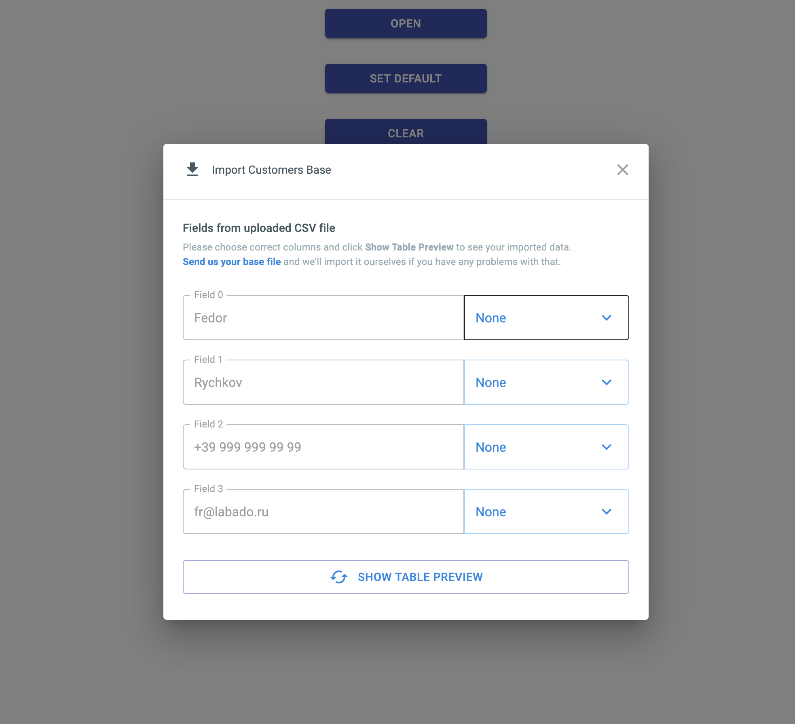
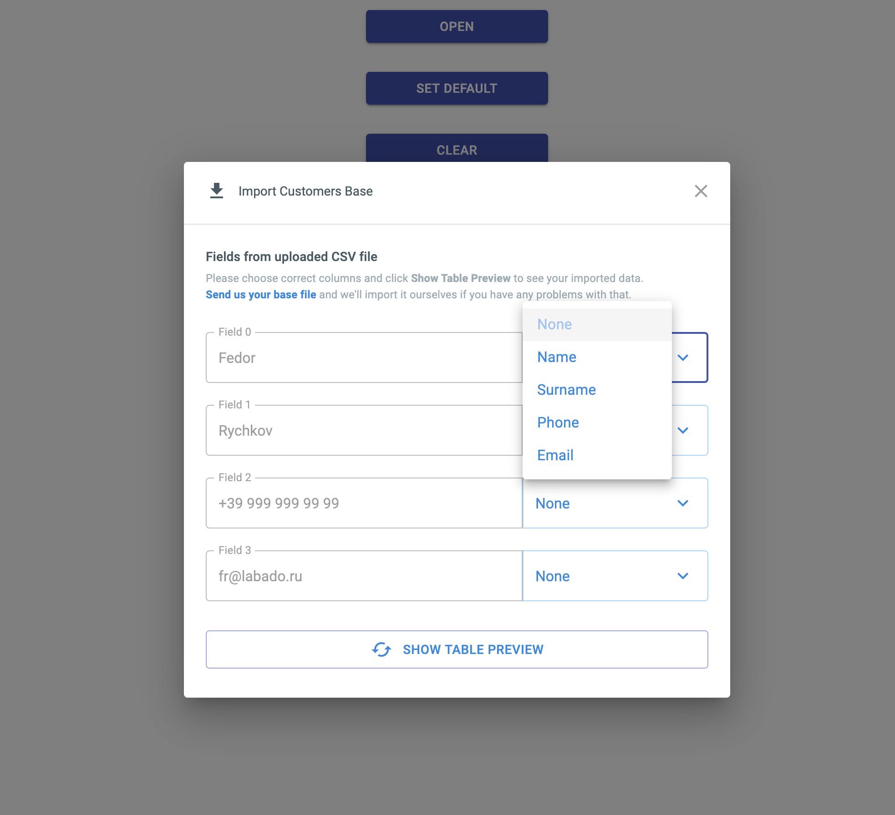
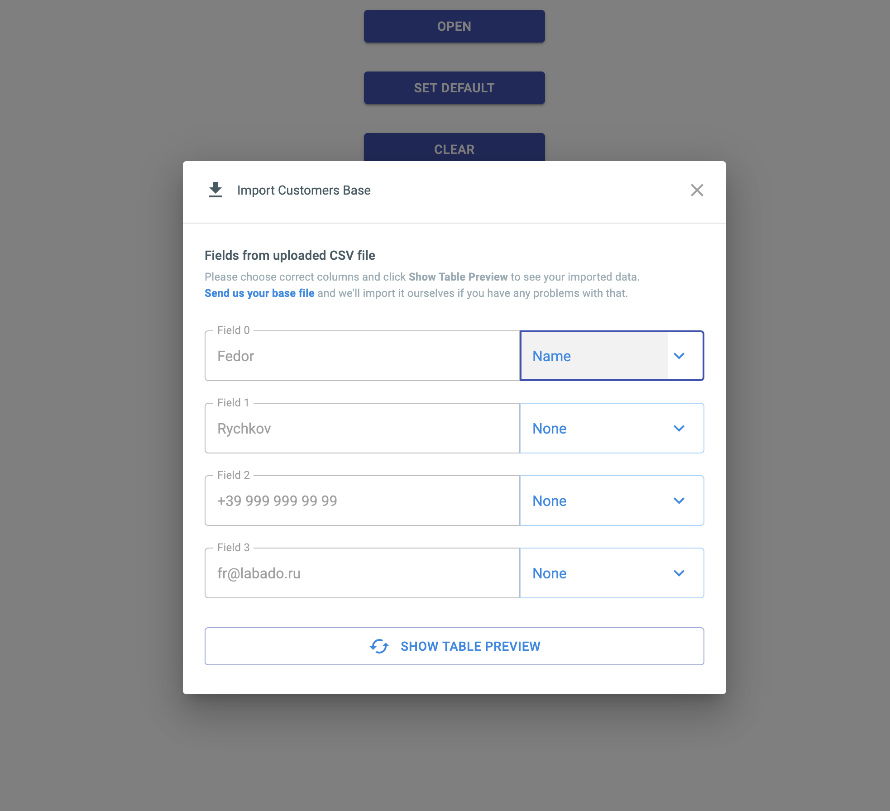
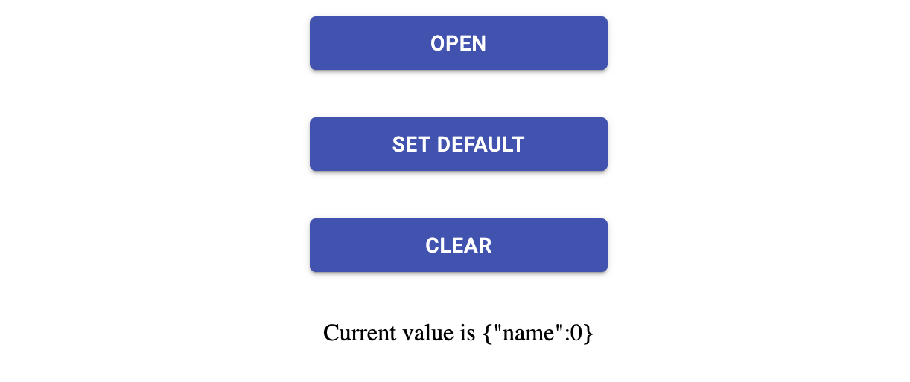
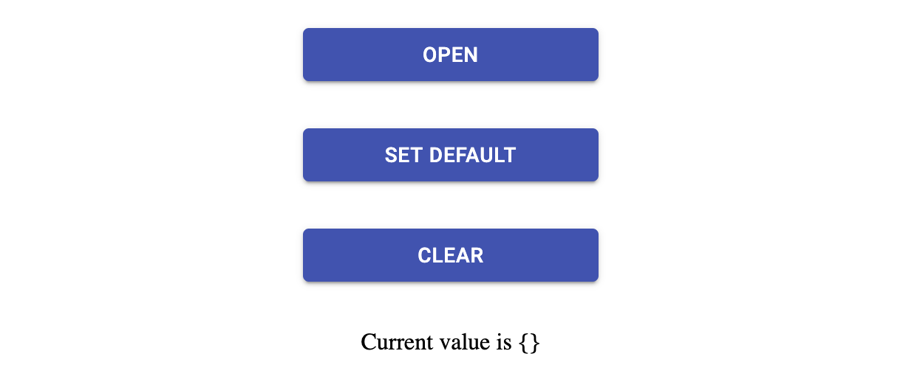
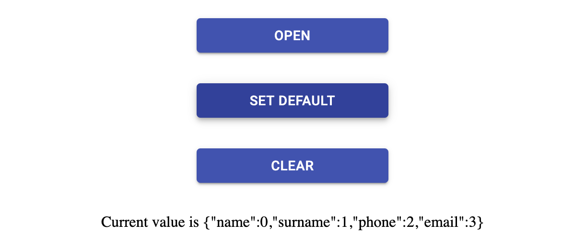
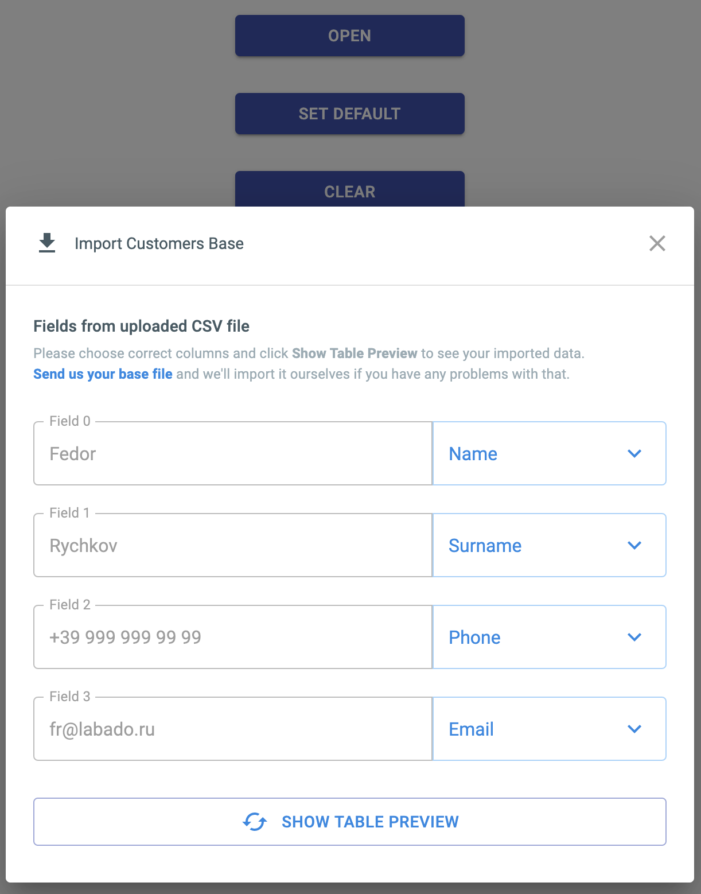

# Test task for PaaS company

## Stack
React, React Router Dom, React Hooks, Material-ui, Styled Components

## How to start
`yarn start` or `yarn build`

## Build Docker container

`docker build -t test-paas .`

## Start on server

`docker run -d --restart=always -p 8080:80 test-paas:latest`

## Description

We have 3 buttons:
1. "Open" popup
2. "Set default" data in popup
3. "Clear data" in popup

### App screens

